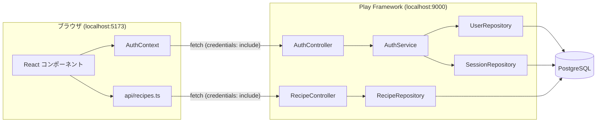
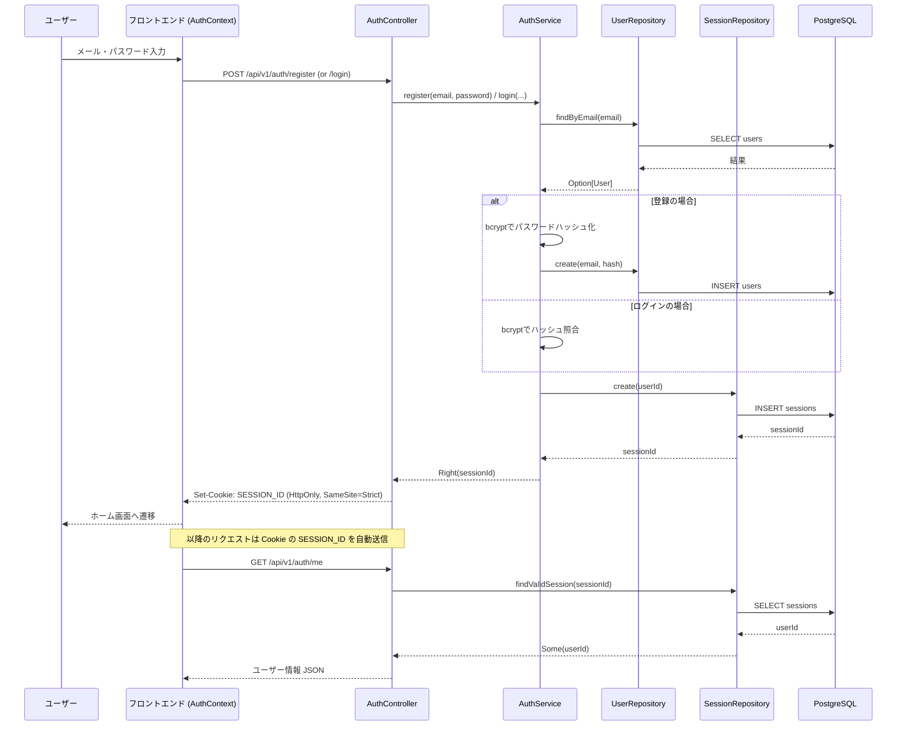
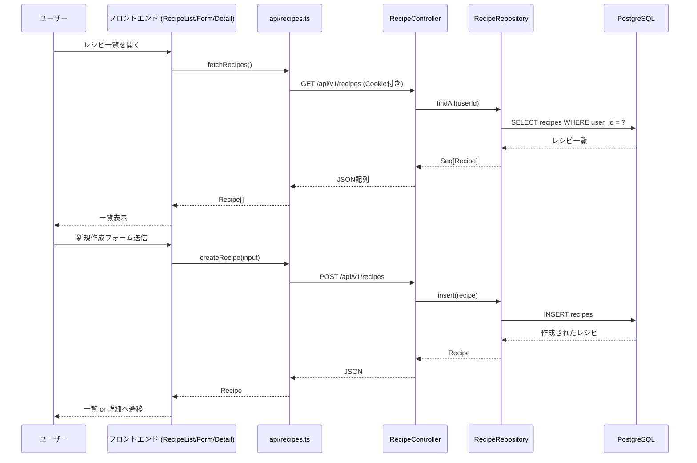

# データフロー図

フロントエンド（React）⇔ バックエンド（Play Framework）⇔ DB（PostgreSQL）間のデータの流れをまとめる。
対応コード:
- `frontend/src/contexts/AuthContext.tsx`, `frontend/src/api/recipes.ts`
- `backend/conf/routes`, `backend/app/controllers/*Controller.scala`
- `backend/app/services/AuthService.scala`
- `backend/app/repositories/*Repository.scala`

## 全体構成

## 認証フロー（登録・ログイン・セッション確認）

## レシピCRUDフロー

## 備考

- 認証は Cookie ベースのセッション管理（`SESSION_ID`、HttpOnly + SameSite=Strict）であり、
  JWTは使用していない（`docs/AUTH.md` 参照）。
- Phase 6以降で `meal_plans` / `shopping_lists` のデータフローが追加される予定。実装時に本ファイルを更新すること。
