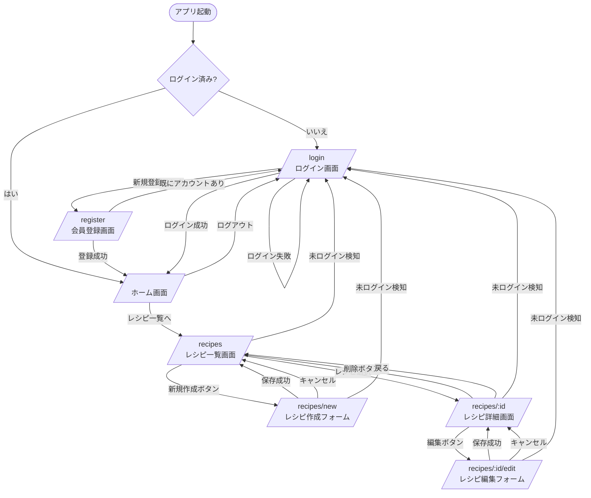

# 画面遷移図

My Kitchen フロントエンド（React Router）の画面遷移をまとめる。
対応コード: `frontend/src/App.tsx`

## 画面一覧

| パス | コンポーネント | 認証要否 |
|---|---|---|
| `/login` | `Login.tsx` | 不要 |
| `/register` | `Register.tsx` | 不要 |
| `/` | `Home.tsx` | 要（`ProtectedRoute`） |
| `/recipes` | `RecipeList.tsx` | 要 |
| `/recipes/new` | `RecipeForm.tsx`（新規作成モード） | 要 |
| `/recipes/:id` | `RecipeDetail.tsx` | 要 |
| `/recipes/:id/edit` | `RecipeForm.tsx`（編集モード） | 要 |

`ProtectedRoute`（`frontend/src/components/ProtectedRoute.tsx`）は `AuthContext` のログイン状態を確認し、
未ログインの場合は `/login` にリダイレクトする。

## 遷移図

## 備考

- Phase 6 以降（カレンダー・献立管理、買い物リスト）の画面はまだ実装されていないため、本図には含めていない。
  実装が進んだ時点で本ファイルを更新すること。
